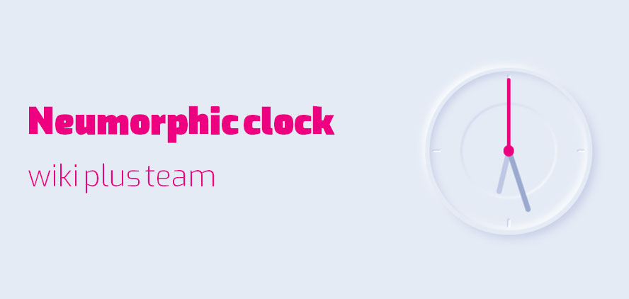

# Neumorphic Clock

This is a simple neumorphic clock project created using HTML, CSS, and JavaScript.

## Preview

## Features

- Neumorphic design for a modern look
- Displays current time with hour, minute, and second hands
- Smooth ticking animation for seconds hand
- Precise timekeeping

## Usage

To use this clock, simply open the `index.html` file in a web browser.

## Customization

You can customize the appearance of the clock by modifying the CSS styles in the `style.css` file. Additionally, you can tweak the behavior of the clock by adjusting the JavaScript code in the `app.js` file.

## Credits

This project is inspired by various neumorphic design trends and clock implementations found online. The codebase is created by Wiki Plus team and is available under the [MIT License](LICENSE).

## License

This project is licensed under the MIT License - see the [LICENSE](LICENSE) file for details.